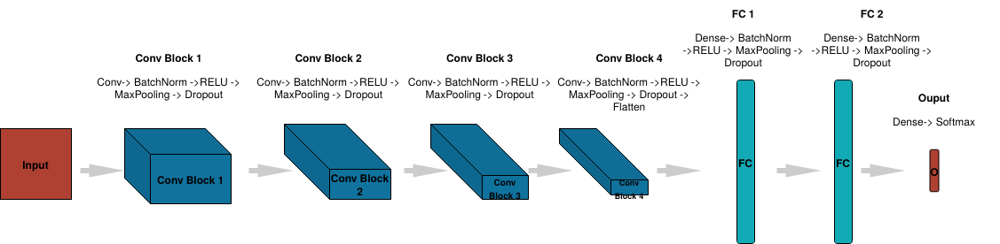

# Live facial expression analysis using a Convolutional Neural Network
Live facial expression analysis using a CNN built in tensorflow.keras

# Installation
`cd \path\to\Project\`

`pip install pipenv`

`pipenv install`

`pipenv run python3 main.py`

# Description

## Dataset
Dataset found [here](https://www.kaggle.com/c/challenges-in-representation-learning-facial-expression-recognition-challenge/data)

* 3171 surprise images
* 7214 happy images
* 4965 neutral images
* 3995 angry images
* 4830 sad images
* 436 disgust images
* 4097 fear images

## Model

Convolutional neural network inspired from [this paper](https://arxiv.org/pdf/1307.0414.pdf)

